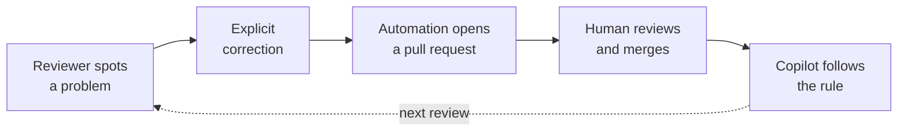

## Step 4: Watch the rule take effect

> **Lesson 1 of 2 · Teach the repository something** · Step 4 of 8

### 📖 Theory: The correction is now part of the context

Your rule is merged, which means it is no longer advice sitting in a comment thread. It is in `.github/copilot-instructions.md`, and Copilot reads that file before it answers anything in this repository.

The loop you just closed looks like this:



Now collect the payoff. You are going to ask Copilot for the exact thing that started this — and this time you should not have to ask for tests.

### ⌨️ Activity: Ask Copilot for the missing tests

1. Check out the pull request branch and bring in the rule you just merged.

   ```bash
   git fetch origin
   git switch add-discount
   git merge origin/main
   ```

   You are now on the branch that adds `applyDiscount`, with your new rule in place.

1. Open Copilot Chat and ask for the change *without mentioning tests at all*:

   ```text
   Add applyDiscount to this project properly.
   ```

1. Read what comes back. Because your rule is now in context, Copilot should propose a test for `applyDiscount` even though you never asked for one. That is the rule doing its job.

### ⌨️ Activity: Commit the tests and finish the pull request

Now turn what you just saw into something the grader can verify.

1. Open `test/cart.test.js` and add `applyDiscount` to the import at the top:

   ```js
   const { addItem, removeItem, subtotal, applyDiscount } = require('../src/cart');
   ```

1. Add a test at the bottom of the file. Cover at least the ordinary case:

   ```js
   test('applyDiscount reduces every price by the given percent', () => {
     const cart = addItem([], { id: 'apple', price: 10 });
     assert.equal(applyDiscount(cart, 25)[0].price, 7.5);
   });
   ```

1. Run the suite and push.

   ```bash
   npm test
   git commit -am "Add tests for applyDiscount"
   git push
   ```

1. Merge the **Add applyDiscount to the cart module** pull request. The gap you found in step 2 is now closed.

1. Mona will check your work and share the next step.

<details>
<summary><b>Having trouble? 🤷</b></summary><br/>

- **Copilot did not mention tests?** Model output varies, and the lesson still holds. Write the test yourself and continue — the rule is what told you it was required.
- **No Copilot access?** Skip the first activity entirely. The second one is the graded part.
- **`applyDiscount is not defined`** means the import at the top of `test/cart.test.js` still needs updating.
- The check looks for every function exported from `src/cart.js` to be referenced in `test/cart.test.js`.
- If `git switch add-discount` fails, run `git fetch origin` first.

</details>
