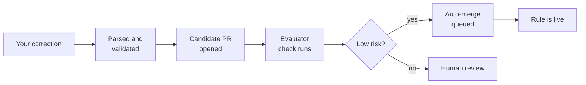

## Step 7: Watch a correction land on its own

> **Lesson 2 of 2 · Let it merge itself** · Step 7 of 8

### 📖 Theory: The loop closes without you

Everything is in place. The policy says what is boring enough to merge itself, branch protection makes sure nothing skips the queue, and the evaluator has the final word on every candidate.

So this time you are going to leave a correction and then walk away.

What happens after you press **Comment**:



Notice that the human-review branch never disappears. You did not remove the reviewer; you removed the reviewer from the cases where they were not adding anything.

### ⌨️ Activity: Leave a correction and let it merge itself

1. Open any pull request in your repository, or reopen the one from Lesson 1.

1. Post a second correction. This one is deliberately narrow, so your policy should classify it as low risk:

   ```md
   /copilot-learn
   category: STYLE
   rule: Use const for values that are never reassigned.
   rationale: Reassignment was used for values that never change.
   scope: path:src/
   ```

1. Open the **Actions** tab and watch it happen. **Propose instruction** validates the correction, opens a candidate, reports the **Evaluate instruction candidate** check on it, and queues it for auto-merge.

1. Do not merge anything. Wait for the candidate pull request to close on its own.

1. Open `.github/copilot-instructions.md` and confirm your second rule is now in the **Learned rules** section, alongside the first.

1. Pull the result and push so the check can see it.

   ```bash
   git switch teach-the-repo
   git pull origin main --no-rebase
   git commit --allow-empty -m "Second correction merged automatically"
   git push
   ```

1. Mona will check your work and share the next step.

<details>
<summary><b>Having trouble? 🤷</b></summary><br/>

- **Candidate still open?** Check the **Checks** tab on it. Auto-merge waits for every required check, so it will sit there until the evaluator finishes.
- **Marked for human review instead?** Run `npm run decide` and compare. A `repository` scope or a blocked category will do this, and it means the guardrails are working.
- Keep `scope: path:src/`. Widening it to `repository` makes the rule medium risk on purpose.
- If nothing happened at all, confirm the comment starts with `/copilot-learn` on the first line.
- **Candidate opened but never queued?** Confirm **Allow auto-merge** is on in **Settings → General** and that your policy reached `main` in step 5.

</details>
