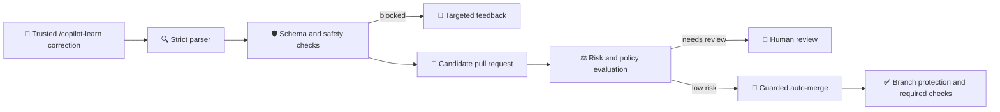

# Self-correcting Copilot instructions

_Leave a review comment once, and have Copilot remember it forever._

## Welcome

You review a pull request and spot something you don't want. You explain it clearly in a comment. The author fixes it, everyone moves on, and the knowledge evaporates — because a review comment is written into a box that nothing ever reads again.

Meanwhile `.github/copilot-instructions.md` sits in your repository steering every suggestion Copilot makes, and it only changes when somebody remembers to go edit it by hand.

This exercise connects the two. You'll review a real pull request, leave a correction, and watch automation turn it into a rule Copilot actually follows. Then you'll let the safe corrections merge themselves.

- **Who is this for**: Anyone who reviews pull requests and uses GitHub Copilot.
- **What you'll learn**:
  - How `.github/copilot-instructions.md` steers Copilot, and why hand-editing it doesn't scale.
  - How to turn a review comment into a durable rule with one explicit command.
  - Why casual feedback must *never* change your instructions, and what makes a correction deliberate.
  - How to let low-risk corrections merge themselves without weakening branch protection.
- **What you'll build**: A working loop where an explicit `/copilot-learn` correction becomes a reviewed pull request against your instructions file — and, once you trust it, merges on its own.
- **Prerequisites**: You should be comfortable reviewing a pull request. [Node.js 20](https://nodejs.org) if you want to run the checks locally.
- **How long**: 45-60 minutes across two lessons.

### Lesson 1 · Teach the repository something

| Step | What you'll do |
| --- | --- |
| **1** | See how instructions work today by adding a rule by hand |
| **2** | Review a pull request and watch good feedback disappear |
| **3** | Turn that feedback into a rule with `/copilot-learn` |
| **4** | Ask Copilot for code and watch it follow your new rule |

### Lesson 2 · Let it merge itself

| Step | What you'll do |
| --- | --- |
| **5** | Decide which corrections are safe enough to merge themselves |
| **6** | Put the automation behind branch protection |
| **7** | Leave a correction and watch it land without you |
| **8** | Attack your own pipeline and confirm it holds |

> [!IMPORTANT]
> This exercise automates **repository instructions**. It does not train GitHub Copilot and it does not make Copilot self-learning. See [`docs/platform-boundary.md`](docs/platform-boundary.md) for exactly where that line sits.

### How to start this exercise

Simply copy the exercise to your account, then give your favorite Octocat (Mona) **about 20 seconds** to prepare the first lesson, then **refresh the page**.

[](https://github.com/new?template_owner=abelberhane&template_name=self-correcting-copilot-instructions&owner=%40me&name=skills-self-correcting-copilot-instructions&description=Exercise%3A+Self-correcting+Copilot+instructions&visibility=public)

<details>
<summary>Having trouble? 🤷</summary><br/>

When copying the exercise, we recommend the following settings:

- For owner, choose your personal account or an organization to host the repository.
- Create a **public** repository. Private repositories [use Actions minutes](https://docs.github.com/en/billing/managing-billing-for-github-actions/about-billing-for-github-actions), and auto-merge in Lesson 2 is unavailable on private repositories using the GitHub Free plan.

If the exercise isn't ready in 20 seconds:

1. After your new repository is created, wait about 20 seconds, then refresh the page.
2. Follow the step-by-step instructions in the issue created in your repository.
3. If the page doesn't refresh automatically, please check the [Actions](../../actions) tab.
   - Check to see if a job is running. Sometimes it simply takes a bit longer.
   - If the page shows a failed job, please submit an issue. Nice, you found a bug! 🐛

Two repository settings are configured during the exercise itself, so you do not need them up front:

- **Step 3** relies on Actions being allowed to create pull requests, under **Settings -> Actions -> General**.
- **Step 6** adds branch protection and turns on auto-merge.

</details>

## How the pipeline works



`.github/copilot-instructions.md` has two sections. Automation may never touch the maintainer-controlled section, and may only extend the learned-rules section between its boundary markers. Every learned rule carries a stable ID, category, lifecycle state, provenance, and fingerprint.

The pipeline is deterministic: no model API, no external service, and no secrets. The same correction always produces the same result, which is what makes it reviewable.

## Run the checks locally

The whole pipeline is deterministic. No model API, external service, or secret is required.

```bash
npm ci
npm test          # unit tests over the pipeline and the sample app
npm run coverage  # which exported functions still have no test
npm run decide    # what your auto-merge policy would do with each correction
npm run validate  # repository structure and workflow safety
npm run simulate  # print the candidate a correction would produce
```

## Reset or retry

Only one step workflow is enabled at a time: each step disables itself and enables the next one when it passes. Re-run a failed step from the **Actions** tab after applying its feedback. To restart the exercise, close the exercise issue, revert learner changes, then enable and run **Step 0**. Re-running **Step 1** will not open a duplicate review pull request. Candidate branches and audit entries are append-only history, so revoke or supersede rules instead of deleting that history.

> [!IMPORTANT]
> Auto-merge uses GitHub's native auto-merge capability. It waits for branch protection and required checks, and never pushes to the default branch or bypasses protections.

## Documentation

| Document | Contents |
| --- | --- |
| [`docs/architecture.md`](docs/architecture.md) | Pipeline components and data flow |
| [`docs/threat-model.md`](docs/threat-model.md) | Each control mapped to the risk it mitigates |
| [`docs/platform-boundary.md`](docs/platform-boundary.md) | What this automates, and what it explicitly does not |
| [`docs/rollback.md`](docs/rollback.md) | Reverting a merged rule and reading the audit trail |
| [`docs/troubleshooting.md`](docs/troubleshooting.md) | Common exercise and workflow failures |

---

Licensed under the [MIT License](LICENSE).
