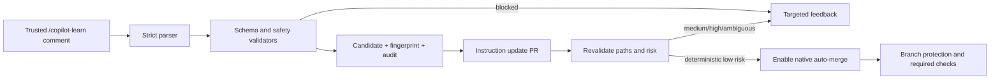

# Architecture

A trusted maintainer comment on a Copilot-associated pull request is parsed as data, never executed. `propose-instruction.yml` creates a deterministic candidate, validates it, renders only the bounded learned-rules section, records provenance, and opens a pull request. `evaluate-instruction.yml` revalidates every update, checks changed paths and risk, and either requests human review or enables native GitHub auto-merge.

